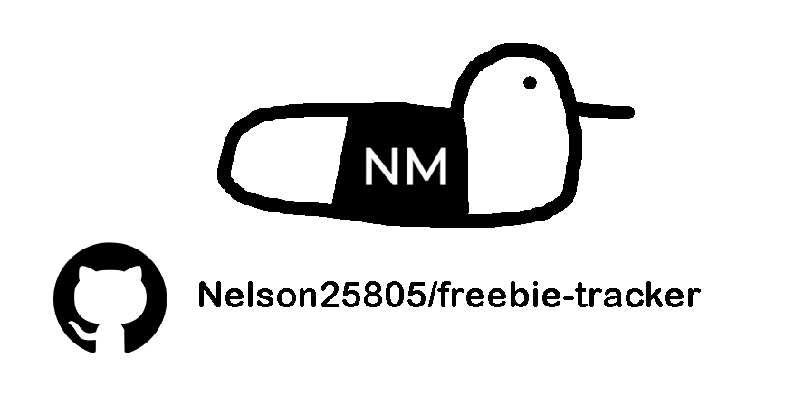

<!-- PROJECT SHIELDS -->
<!--
*** I'm using markdown "reference style" links for readability.
-->
[![Contributors][contributors-shield]][contributors-url]
[![Forks][forks-shield]][forks-url]
[![Stargazers][stars-shield]][stars-url]
[![Issues][issues-shield]][issues-url]
[![project_license][license-shield]][license-url]
[![LinkedIn][linkedin-shield]][linkedin-url]

<!-- PROJECT LOGO -->
 

  

<h3 align="center">Freebie Tracker</h3>

  

    A simple java application to receive recipe's for a multitude of recipes depending on the ingredients available.
     
    <a href="https://github.com/Nelson25805/freebie-tracker"><strong>Explore the docs »</strong></a>
     
     
    <a href="https://github.com/Nelson25805/freebie-tracker">View Demo</a>
    &middot;
    <a href="https://github.com/Nelson25805/freebie-tracker/issues/new?labels=bug">Report Bug</a>
    &middot;
    <a href="https://github.com/Nelson25805/freebie-tracker/issues/new?labels=enhancement">Request Feature</a>
  

<!-- TABLE OF CONTENTS -->

  
Table of Contents

  <ol>
    <li>
      <a href="#about-the-project">About The Project</a>
      <ul>
        <li><a href="#built-with">Built With</a></li>
      </ul>
    </li>
    <li>
      <a href="#getting-started">Getting Started</a>
      <ul>
        <li><a href="#installation">Installation</a></li>
      </ul>
    </li>
    <li><a href="#usage">Usage</a></li>
    <li><a href="#contributing">Contributing</a></li>
    <li><a href="#license">License</a></li>
    <li><a href="#contact">Contact</a></li>
  </ol>

<!-- ABOUT THE PROJECT -->
## About The Project

![Free Game Tracker Screenshot][project-screenshot]

Free Game Tracker is a lightweight web application that automatically tracks free game promotions across multiple digital storefronts in one convenient location.

Instead of checking several websites every day, the tracker collects current and upcoming giveaways and presents them in a clean, searchable interface.

Current supported stores include:

- Epic Games Store
- GOG
- PlayStation Plus
- Prime Gaming

Features include:

- View all current free games in one place
- Browse upcoming giveaways before they become available
- Search by game title or store
- Filter by platform or promotion status
- Sort by ending soon, newest, or title
- Mark games as collected
- Hide games you've already claimed
- Automatically updated several times each day using GitHub Actions

Claimed games are stored locally in your browser, so your collection persists between visits without requiring an account.

This project demonstrates working with:

- Public APIs
- Web scraping
- GitHub Actions automation
- JSON data generation
- Modern JavaScript
- Responsive web design

(<a href="#readme-top">back to top</a>)

## Built With

| Badge | Description |
|:-----:|-------------|
|  | Page structure |
|  | Styling |
|  | Frontend functionality |
|  | Fetch scripts |
|  | Automatic scheduled updates |

(<a href="#readme-top">back to top</a>)

<!-- GETTING STARTED -->
## Getting Started

Follow these steps to run the project locally.

### Prerequisites

- Node.js (recommended v18 or newer)
- Git

### Installation

1. Clone the repository

git clone https://github.com/Nelson25805/freebie-tracker.git
Navigate into the project
cd freebie-tracker
Install dependencies
npm install
Generate the latest game data
npm run update
Open index.html

or host the project using your preferred local web server.

## Usage

When the site loads, the latest game promotions are displayed automatically.

You can:

- Search games by title
- Filter by storefront
- Filter current or upcoming promotions
- Sort by ending soon, newest, or title
- Mark games as collected
- Hide collected games
- Open each game's store page with a single click

The tracker automatically refreshes its data several times a day using GitHub Actions. Since all game information is pre-generated into a static JSON file, visitors don't need API keys and no live API requests occur when loading the website.

Collected games are saved using your browser's local storage.

<!-- USAGE -->

## Usage

When the application starts, you will see a main menu with these options:

Search for recipes by ingredient
Exit

To search for a recipe:

choose option 1
enter an ingredient such as chicken, rice, or pasta
browse the matching recipes returned by TheMealDB
select a recipe to view ingredients and instructions
choose whether to save the recipe to a local text file

Saved recipes are stored in a Recipes folder in the project directory.

(<a href="#readme-top">back to top</a>)
 <!-- FEATURES -->

## Contributing

Contributions are what make the open source community such an amazing place to learn and create. Any contributions you make are greatly appreciated.

Fork the Project
Create your Feature Branch (git checkout -b feature/AmazingFeature)
Commit your Changes (git commit -m 'Add some AmazingFeature')
Push to the Branch (git push origin feature/AmazingFeature)
Open a Pull Request

(<a href="#readme-top">back to top</a>)

## Top contributors:

## License

Distributed under the project_license. See LICENSE.txt for more information.

(<a href="#readme-top">back to top</a>)
 <!-- CONTACT -->
## Contact

Nelson McFadyen - Nelson25805@hotmail.com

Project Link: https://github.com/Nelson25805/freebie-tracker

(<a href="#readme-top">back to top</a>)
 <!-- MARKDOWN LINKS -->

<!-- MARKDOWN LINKS & IMAGES -->
<!-- https://www.markdownguide.org/basic-syntax/#reference-style-links -->
[contributors-shield]: https://img.shields.io/github/contributors/Nelson25805/freebie-tracker.svg?style=for-the-badge
[contributors-url]: https://github.com/Nelson25805/freebie-tracker/graphs/contributors
[forks-shield]: https://img.shields.io/github/forks/Nelson25805/freebie-tracker.svg?style=for-the-badge
[forks-url]: https://github.com/Nelson25805/freebie-tracker/network/members
[stars-shield]: https://img.shields.io/github/stars/Nelson25805/freebie-tracker.svg?style=for-the-badge
[stars-url]: https://github.com/Nelson25805/freebie-tracker/stargazers
[issues-shield]: https://img.shields.io/github/issues/Nelson25805/freebie-tracker.svg?style=for-the-badge
[issues-url]: https://github.com/Nelson25805/freebie-tracker/issues
[license-shield]: https://img.shields.io/github/license/Nelson25805/freebie-tracker.svg?style=for-the-badge
[license-url]: https://github.com/Nelson25805/freebie-tracker/blob/master/LICENSE.txt
[linkedin-shield]: https://img.shields.io/badge/-LinkedIn-black.svg?style=for-the-badge&logo=linkedin&colorB=555
[linkedin-url]: https://www.linkedin.com/in/nelson-mcfadyen-806134133/

[project-Image]: GithubImages/projectImage.png

[project-screenshot]: GithubImages/mainScreen.png
[project-screenshot2]: GithubImages/filteredGameSearch.gif
[project-screenshot3]: GithubImages/randomGameSearch.gif

[project-screenshot4]: GithubImages/excelExample.png
[project-screenshot5]: GithubImages/envExample.png

[Java-url]: https://www.java.com/en/download/manual.jsp
[GTK3-url]: https://www.gtk.org/
[SQLite3-url]: https://www.sqlite.org/download.html
[OpenSSL-url]: https://openssl-library.org/source/
[Bcrypt-url]: https://rubygems.org/gems/bcrypt/versions/3.1.12?locale=en

[Python]: https://img.shields.io/badge/python-3670A0?style=for-the-badge&logo=python&logoColor=ffdd54
[Tkinter]: https://img.shields.io/badge/Tkinter-8.6-green
[JQuery.com]: https://img.shields.io/badge/jQuery-0769AD?style=for-the-badge&logo=jquery&logoColor=white

